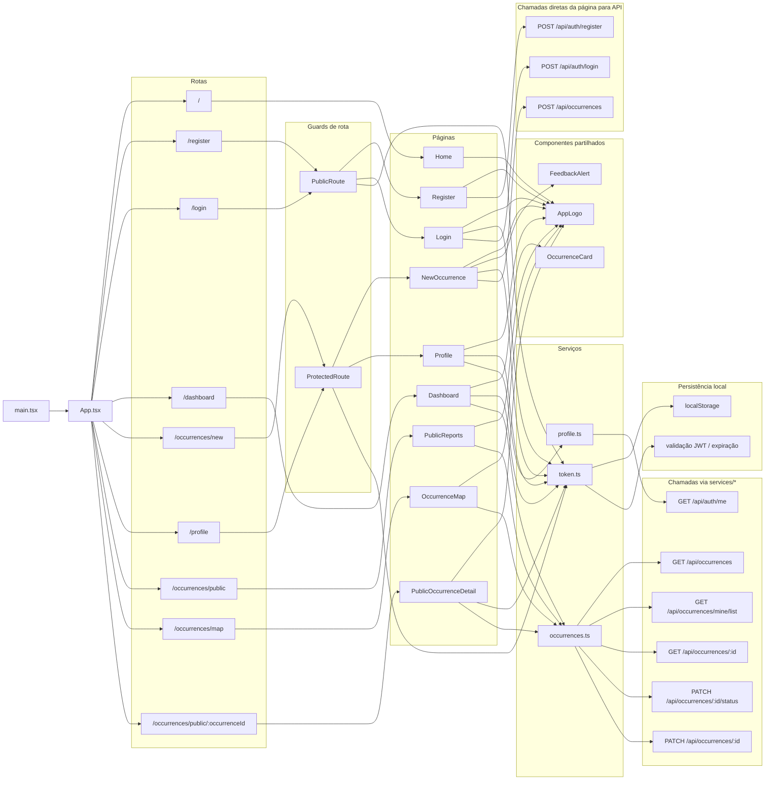

# SCRUM-194 — Diagrama de Componentes do Frontend

## Objetivo

Representar visualmente a estrutura atual do frontend, incluindo:

- páginas
- guards de rota
- componentes partilhados
- serviços
- pontos de integração com a API

## Diagrama Geral

## Leitura do Diagrama

- `App.tsx` centraliza as rotas do frontend.
- `PublicRoute` controla acesso a `login` e `register` quando já existe sessão.
- `ProtectedRoute` protege `new occurrence` e `profile`.
- O `dashboard` está fora de `ProtectedRoute`, apesar de usar estado de autenticação.
- `AppLogo` é o componente mais reutilizado entre páginas.
- `OccurrenceCard` é usado no dashboard.
- `FeedbackAlert` aparece no fluxo de criação de ocorrência.

## Relações Principais

### Páginas com acesso direto à API

- `Register` faz `POST /api/auth/register`
- `Login` faz `POST /api/auth/login`
- `NewOccurrence` faz `POST /api/occurrences`

### Páginas que usam `services/*`

- `Dashboard` usa `token.ts` e `occurrences.ts`
- `PublicReports` usa `occurrences.ts`
- `OccurrenceMap` usa `occurrences.ts`
- `PublicOccurrenceDetail` usa `token.ts` e `occurrences.ts`
- `Profile` usa `token.ts` e `profile.ts`
- `PublicRoute` e `ProtectedRoute` dependem de `token.ts`

## Observações Técnicas

- A arquitetura atual mistura duas abordagens:
  - páginas que chamam a API diretamente
  - páginas que delegam chamadas em `services/*`

- `token.ts` funciona como serviço transversal de sessão e autenticação.

- `occurrences.ts` concentra a maior parte das integrações do domínio de ocorrências, mas a criação de nova ocorrência ainda está implementada diretamente na página `NewOccurrence`.

- `dashboard` comporta-se como página híbrida:
  - com token, mostra dados do utilizador e ocorrências próprias
  - sem token, mostra conteúdo público

## Conclusão

O frontend está organizado em torno de `App.tsx`, páginas por rota, alguns componentes partilhados e três serviços principais. O diagrama mostra que a maior oportunidade de uniformização está na camada de integração, porque parte das páginas ainda comunica com a API diretamente em vez de passar por `services/*`.
